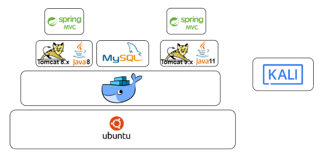

# Content Management System MVC
[](https://app.fossa.com/projects/git%2Bgithub.com%2Fevfim%2FJavaTest1?ref=badge_shield)


This is a simple Spring MVC 5.x application project built with Maven, incorporating dependencies such Bootstrap, J2EE and Spring Security Module. Originally built for an interview coding assignment even though the author did not eventually work for that company. Full source code is released under GNU GPL v3.

P.S. The project is misnamed CRMMVC, should be CMSMVC but it was too late to change :)

## :exclamation: Deliberately Vulnerable Application (Do not use in production environment)
This repository has been forked and configure to demonstrate two Java EE based vulnerabilities:
### 1. Log4Shell (CVE-2021-44228)
- Log4j dependency adding into pom.xml using vulnerable version 2.14.1.
- Injected vulnerable code into `/login2` routing in LoginController.java
- Docker container using Tomcat 8.x on Java 8 image `tomcat:8.0.36-jre8`.

### 2. Spring4Shell (CVE-2022-22965)
- Spring Security filtering disabled in web.xml.
- Spring Framework downgraded to vulnerable version 5.3.17 in pom.xml.
- Docker container using Tomcat 9.x on Java 11 image `tomcat-9.0.59-jdk11`.

## Provisioning POC using Vagrant Up for VirtualBox
We use Vagrant for provisioning of VirtualBox virtual an attacker and victim server machine for the purpose of this POC.
Internally, the server VM uses Docker technology to spin up containers that binds to the respective port on the server host.


1. In terminal, change directory to `environment/`.
2. Ensure Vagrant and Virtualbox is installed (See https://www.vagrantup.com/downloads).
3. Run `vagrant up`in terminal.

  ```
  $ cd ~/crmmvc/environment/
  $ vagrant up
  ```

## Setup Database

1. Connect to MySQL Server 8.x or MariaDB on MySQL Workbench using DBAdmin User database credentials located in db/db.env.
2. Under Navigator panel, select Management tab, select _Data Import/Restore_.
3. Under _Import from Self-Contained File_, locate the _Database.sql_ inside `db/` directory.
4. Under _Default Schema to be Imported to_ section, click _New_ to create new schema.
5. Ensure 'Dump Structure and Data' is selected, click _Start Import_.

## Build Project

- Using IntelliJ IDEA Ultimate (Can be activated using Academic Licence)
1. Open in Spring MVC source project in IntelliJ IDEA Ultimate IDE.
2. Open up src/main/resources/application.properties in the source project.
3. Ensure database credentials _jdbc.url, jdbc.username and jdbc.password_ are correct. Save for any change.
4. Open the Maven tab located on the right-hand side of the IDE, and go to `CRMMVC Maven Webapp` >  `Lifecycle` > `package`.
5. CRMMVC.war should appear under `target/` directory of the project root.

- Using Maven
1. Ensure Maven is installed in the system and added into System Environmental PATH (Refer to https://maven.apache.org/install.html).
2. In the terminal, change the working directory to <Project Root>.
  ```
  $ cd ~/crmmvc/
  ```
3. Run Maven to clean and package the project into a web archive. CRMMVC.war should appear under `target/` directory of the project root.
  ```
  $ mvn clean package
  ```
## Run Source Code in IDE

1. Set up a Tomcat 9.x installation by downloading and unzip the archive from https://tomcat.apache.org/download-90.cgi. Ensure JRE > 8.x is installed.
2. In IntelliJ, go to `Run` > `Edit Configurations`.
3. In the `Run/Debug Configurations` dialog, click `+` and select `Tomcat Server` > `Local`.
4. In Server tab, click `Configure` button beside `Application Server`.
5. In Application Server dialog, click on `+`. Ensure Tomcat Home and Tomcat base directory is pointing to the unzipped Tomcat installation (e.g. /usr/share/tomcat9/).  Click OK.
6. In the `Run/Debug Configurations`, go to Deployment tab and click `+`. Select artifact `CRMMVC.WAR`. Specify the `Application Context` (e.g. /CRMMVC), then click OK.
7. Go to `Run` > `Run...` or press Shift+F10 to run project in Tomcat server.
  
## Run Source Code using Docker
  
1. Ensure Docker is installed in the system. See https://docs.docker.com/get-docker/ for details.
2. In the terminal, change the working directory to <Project Root>, then run Docker Compose.
  ```
  $ cd ~/crmmvc/
  $ docker-compose up --build
  ```

## Deploy WAR to Tomcat
  
1. Copy target/CRMMVC.war to _\<your tomcat directory\>_/webapps/ of your Tomcat server installation. Restart Tomcat server if necessary.
2. Open up web browser and access the URL http://<hostname>:8080/CRMMVC/.


## License
[](https://app.fossa.com/projects/git%2Bgithub.com%2Fevfim%2FJavaTest1?ref=badge_large)